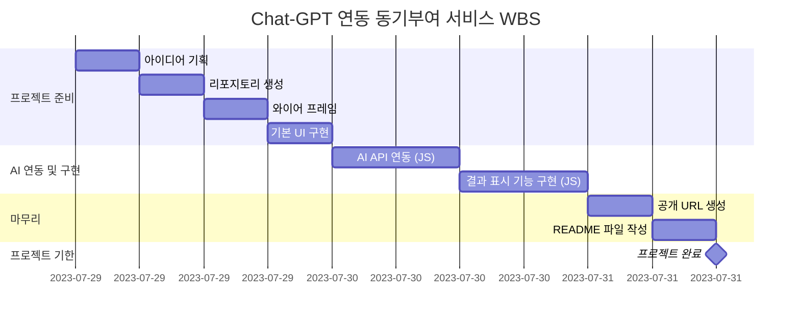

# 동기부여 코치 AI-M

## 아이디어
- 목표는 있지만 의욕이 없거나 꺾일 때 늘 다시 '동기부여'가 필요합니다.
- 스스로 동기부여를 낼 수 있으면 최고지만, 동기부여가 되는 말을 텍스트로 읽게 되면 마음을 다잡을 수 있게 됩니다.
- 목표를 상기시키고 마음을 다잡기 위해 목표와 현재 상태를 입력하고 그에 맞는 동기부여가 되는 말을 해주는 챗봇을 만들었습니다.

## WBS

## 와이어프레임

[피그마 링크](https://www.figma.com/design/pJDMri393hCWavvNmTVN0E/AIM?node-id=0-1&t=GxYUCK5Ys65OCrY9-1)

## 기능
1. FORM 형식에 맞게 각 정보들을 입력 받습니다.
    1. 목표(해야 하는 일)
    2. 현재 상태(마음 가짐, 어떤 점에서 어려움을 겪고 있는 지)
    3. 말투(어떤 느낌으로 동기 부여 받고 싶은 지)
      
2. 입력한 정보들을 Chat-GPT가 프롬프트 형식에 맞게 대답해 줍니다.
    1. 어조에 맞게 자기소개 한 줄
    2. 현재 나의 상태와 성찰 촉진
    3. 동기부여와 책임감 제공
    4. 구체적인 목표 설정과 일일 도전과제 제공
    5. 정서적 지원과 격려

3. 'q'나 종료를 입력하면 첫 화면으로 돌아가게 됩니다.

## 구현
### HTML
- HTML
    - 첫 페이지
        - form 형태의 컨테이너 구성
        - textarea로 현재 상태에 관한 부분은 여러 줄 작성할 수 있게 함
        - 동기부여 받기 버튼
    - 채팅 페이지
        - ai 채팅, 사용자 채팅, 전송 버튼으로 구성

### CSS
- CSS
    - 첫 페이지
        - backgroud-size: cover, z-index: -1으로 화면에 맞게 사진 배치
        - 타이틀을 중앙에 배치하고 그 옆에 아이콘을 넣기 위해 top: 50%, translateY(50%)로 위치 조절
    - 채팅 페이지
        - 각 메세지 사이에 20px의 여백을 둠
        - ai 메세지는 왼쪽에서 시작하여 오른쪽으로 표시
        - 사용자 메세지는 row-reverse로 오른쪽에서 시작하여 왼쪽으로 표시

### JS
- JS
    - 첫 페이지
        - 앞에 form을 id를 넣고 form이 제출될 때 함수 실행
        - formData에 각각의 질문에 입력한 값을 객체에 저장
        - formData를 JSON 문자열로 변환하여 motivationData 키에 저장
        - 제출 후 chatting-page로 이동
    - 채팅 페이지
        - 이전에 저장한 데이터를 로컬 스토리지에 불러와 저장
        - chat-gpt api를 호출하여 AI 응답을 받음
        - 요청 실패 처리
        - 삼항 연산자를 통해 true 면 ai 채팅, false면 사용자 채팅
        - 채팅 컨테이너를 스크롤 높이와 동일하게 하여 채팅이 생성될 때 자동으로 스크롤이 내려갑니다.
        - 이전에 저장한 form 데이터를 프롬프트에 입력 후 대답양식에 맞게 호출
        - 어조를 system role에 직접 저장
        - 'q'나 '종료'를 입력 시 첫 페이지로 이동

[프로그램 링크](https://donggyu-kim1.github.io/AI-motivation/)

## 에러 및 해결 방안
1. 통신 에러 발생: 받는 값은 딕셔너리 형태인데 호출함수로 prompt만 입력했음 -> messages 변수를 만들어 딕셔너리 형태로 하여 값을 받음
2. 제목 중앙정렬: flex로 묶을 시 text가 왼쪽으로 치우침 -> 따로 아이콘을 위치를 지정함
3. 대화 중 답장 시 말투 풀림: 이후 메세지에 롤 지정을 하지 않음 -> 이후 메세지에도 system role에 말투를 받을 수 있게 적용

## 시연 영상

