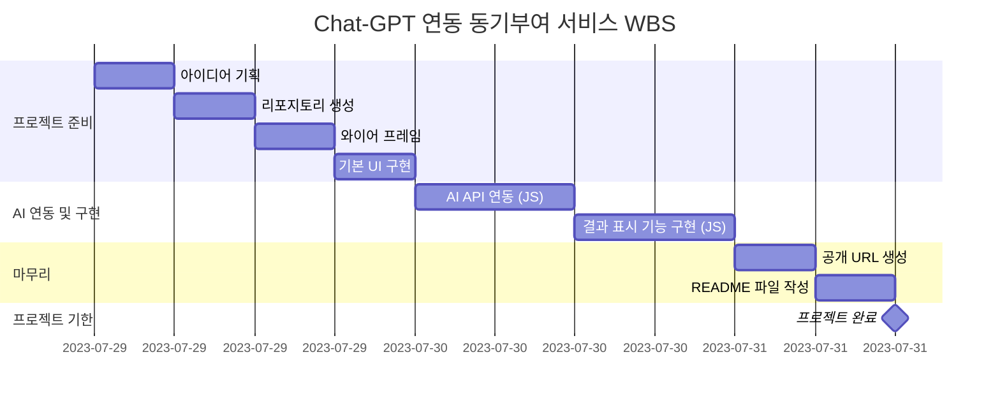

# 동기부여 코치 AI-M

## 아이디어
- 목표는 있지만 의욕이 없거나 꺾일 때 늘 다시 '동기부여'가 필요합니다.
- 스스로 동기부여를 낼 수 있으면 최고지만, 동기부여가 되는 말을 텍스트로 읽게 되면 마음을 다잡을 수 있게 됩니다.
- 목표를 상기시키고 마음을 다잡기 위해 목표와 현재 상태를 입력하고 그에 맞는 동기부여가 되는 말을 해주는 챗봇을 만들었습니다.

## WBS

## 와이어프레임

[피그마 링크](https://www.figma.com/design/pJDMri393hCWavvNmTVN0E/AIM?node-id=0-1&t=GxYUCK5Ys65OCrY9-1)

## 기능
1. FORM 형식에 맞게 각 정보들을 입력 받습니다.
    1. 목표(해야 하는 일)
    2. 현재 상태(마음 가짐, 어떤 점에서 어려움을 겪고 있는 지)
    3. 말투(어떤 느낌으로 동기 부여 받고 싶은 지)
      
2. 입력한 정보들을 Chat-GPT가 프롬프트 형식에 맞게 대답해 줍니다.
    1. 어조에 맞게 자기소개 한 줄
    2. 현재 나의 상태와 성찰 촉진
    3. 동기부여와 책임감 제공
    4. 구체적인 목표 설정과 일일 도전과제 제공
    5. 정서적 지원과 격려

3. 'q'나 종료를 입력하면 첫 화면으로 돌아가게 됩니다.

## 구현
### HTML

### CSS

### JS

[프로그램 링크](https://donggyu-kim1.github.io/AI-motivation/)

## 에러 및 해결 방안

## 시연 영상

