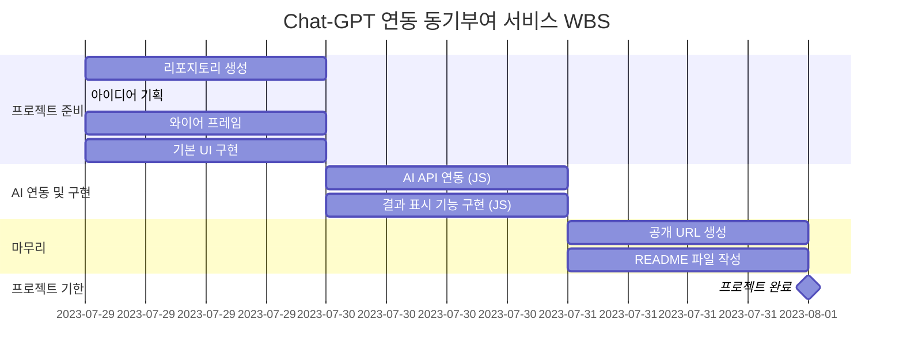

# 동기부여 코치 AI-M

## 아이디어 기획
- 뭔가 하고 싶은 게 있지만 의욕이 없을 때 늘 다시 '동기부여'가 필요합니다.
- 스스로 동기부여를 낼 수 있으면 최고지만, 동기부여가 되는 말을 텍스트로 읽게 되면 마음을 다잡을 수 있게 됩니다.
- 따라서, 목표와 현재 상태를 입력하고 그에 맞는 동기부여가 되는 말을 해주는 chatbot을 만들어 봤습니다.

## WBS

## 와이어프레임

[피그마 링크](https://www.figma.com/design/pJDMri393hCWavvNmTVN0E/AIM?node-id=0-1&t=GxYUCK5Ys65OCrY9-1)

## 구현
[프로그램 링크](https://donggyu-kim1.github.io/AI-motivation/)

## 시연 영상
